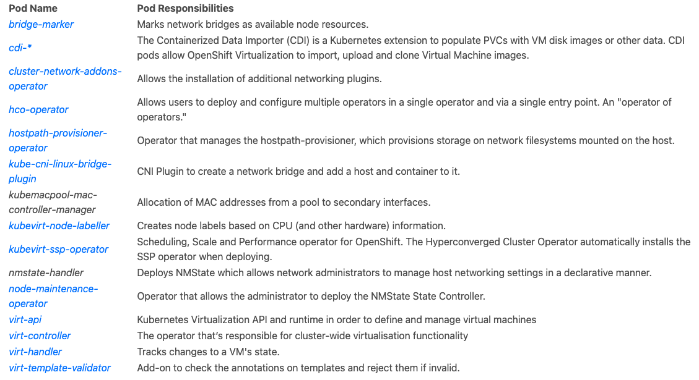

# OCP-CNV

## Login to the lab

- The environment "OpenShift AIO with OCP Virtualization" is needed from RHPDS.
- Login to lab host with the information from received email

  ```
  ssh lab-user@145.40.121.163
  ```

- SSH to bastion then

  ```
  ssh root@192.168.123.100
  ```

- Get kubeadmin password of the environment

  ```
  echo $(cat /root/ocp-install/auth/kubeadmin-password)
  ```

- Get the console URL

  ```
  oc whoami --show-console
  ```

- Validate the cluster is healty

  ```
  oc get nodes
  ```

## Deploying OpenShift Virtualization

- Open the OpenShift console and go to Operator hub menu

  
  
  

- Next we need to deploy the HyperConverged resource, which, in addition to the OpenShift Virtualization operator, creates and maintains an OpenShift Virtualization Deployment for the cluster. Click on "Create HyperConverged", as a required operand, in the same screen to proceed.

  

- This will open a new screen. We can again accept all the defaults for this lab. Continue the installation by clicking on "Create" at the bottom.

  

- After a while, all these pods must be in RUNNING status

  ```
  watch -n2 'oc get pods -n openshift-cnv'
  ```

- The operator installation just be in succeded

  ```
  oc get csv -n openshift-cnv
  ```

- Description of the pods:

  

- There's also a few custom resources that get defined too. For example the NodeNetworkState (nns) provides the current network configuration of our nodes - this is used to verify whether physical networking configurations have been successfully applied by the nmstate-handler pods. This is useful for ensuring that the NetworkManager state on each node is configured as required. We use this for defining interfaces/bridges on each of the machines for both physical machine connectivity and for providing network access for pods (and virtual machines) within OpenShift/Kubernetes. View the NodeNetworkState state with:

  ```
  oc get nns -A
  ```

  Example:

  ```
  [root@ocp4-bastion ~]# oc get nns -A
  NAME                           AGE
  ocp4-master1.aio.example.com   9m45s
  ocp4-master2.aio.example.com   9m47s
  ocp4-master3.aio.example.com   9m56s
  ocp4-worker1.aio.example.com   9m54s
  ocp4-worker2.aio.example.com   9m50s
  ocp4-worker3.aio.example.com   9m57s
  [root@ocp4-bastion ~]#
  ```

- You can then view the details of each managed node with:

  ```
  oc get nns/ocp4-worker1.aio.example.com -o yaml
  ```

## Storage

- Check Storage Classes of the lab

  ```
  oc get sc
  ```

- Then check which version of the OCS operator is installed by executing the following

  ```
  oc get csv -n openshift-storage
  ```

  Example

  ```
  [root@ocp4-bastion ~]# oc get csv -n openshift-storage
  NAME                   DISPLAY                       VERSION   REPLACES               PHASE
  mcg-operator.v4.9.12   NooBaa Operator               4.9.12    mcg-operator.v4.9.11   Succeeded
  ocs-operator.v4.9.12   OpenShift Container Storage   4.9.12    ocs-operator.v4.9.11   Succeeded
  odf-operator.v4.9.12   OpenShift Data Foundation     4.9.12    odf-operator.v4.9.11   Succeeded
  ```

- create the PVC with all this included:

  ```
  cat << EOF | oc apply -f -
  apiVersion: v1
  kind: PersistentVolumeClaim
  metadata:
    name: "rhel8-ocs"
    labels:
      app: containerized-data-importer
    annotations:
      cdi.kubevirt.io/storage.import.endpoint: "http://192.168.123.100:81/rhel8-kvm.img"
  spec:
    volumeMode: Block
    storageClassName: ocs-storagecluster-ceph-rbd
    accessModes:
    - ReadWriteMany
    resources:
      requests:
        storage: 40Gi
  EOF
  ```

- Once created, CDI triggers the importer pod automatically to take care of the conversion for you:

  ```
  oc get pods
  ```

- You should see the importer pod as below:

  ```
  NAME                   READY   STATUS              RESTARTS   AGE
  importer-rhel8-ocs     0/1     ContainerCreating   0          1s
  ```

- Watch the logs and you can see the process, it may initially give an error about the pod waiting to start, you can retry after a few seconds:

  ```
  oc logs importer-rhel8-ocs -f
  ```

- You will see the log output as below:

  ```
  I1103 17:33:42.409423       1 importer.go:52] Starting importer
  I1103 17:33:42.442150       1 importer.go:135] begin import process
  I1103 17:33:42.447139       1 data-processor.go:329] Calculating available size
  I1103 17:33:42.448349       1 data-processor.go:337] Checking out block volume size.
  I1103 17:33:42.448380       1 data-processor.go:349] Request image size not empty.
  I1103 17:33:42.448395       1 data-processor.go:354] Target size 40Gi.
  I1103 17:33:42.448977       1 nbdkit.go:269] Waiting for nbdkit PID.
  I1103 17:33:42.949247       1 nbdkit.go:290] nbdkit ready.
  I1103 17:33:42.949288       1 data-processor.go:232] New phase: Convert
  I1103 17:33:42.949328       1 data-processor.go:238] Validating image
  I1103 17:33:42.969690       1 qemu.go:250] 0.00
  I1103 17:33:47.145392       1 qemu.go:250] 1.02
  I1103 17:33:53.728302       1 qemu.go:250] 2.03
  I1103 17:33:55.924329       1 qemu.go:250] 3.05
  I1103 17:33:58.014054       1 qemu.go:250] 4.06
  (...)
  I0317 11:46:56.253155       1 prometheus.go:69] 98.24
  I0317 11:46:57.253350       1 prometheus.go:69] 100.00
  I0317 11:47:00.195494       1 data-processor.go:205] New phase: Resize
  I0317 11:47:00.524989       1 data-processor.go:268] Expanding image size to: 40Gi
  I0317 11:47:00.878420       1 data-processor.go:205] New phase: Complete
  ```

- To view the structure of the importer pod to get some of the configuration it's using

  ```
  oc describe pod $(oc get pods | awk '/importer/ {print $1;}')
  ```

- Display the PVC

  ```
  oc get pvc
  ```

- Display the PVs

  ```
  oc get pv
  ```

### Optional: Inspect the image

- Let's take a look on the Ceph-backed storage system for more information about the image
- We can do this by matching the PVC to the underlying RBD image
- First describe the persistent volume to get the UUID of the image name by matching the ID of the PV for rhel8-ocs

  ```
  oc describe pv/pvc-1a4ea2c5-937c-486d-932c-b2b7d161ec0e | grep imageName
  ```

- This gives us the imageName we need.
- Now we need to look at the image on the OpenShift cluster itself. We do this by first attaching to a special pod containing Ceph CLI tools, and then asking for details about the image in question

  ```
  oc exec -it -n openshift-storage $(oc get pods -n openshift-storage | awk '/tools/ {print $1;}') bash
  ```

- Now, in the pod's terminal we can use the rbd command to inspect the image, noting we must specify the pool name "ocs-storagecluster-cephblockpool" as this is a "block" type of PV

  ```
  rbd info csi-vol-70d062c5-408f-11ec-a2b0-0a580a830025 --pool=ocs-storagecluster-cephblockpool
  ```

  Example:

  ```
  bash-4.4$ rbd info csi-vol-b9c030c1-661a-11ed-a45d-0a580a80020c --pool=ocs-storagecluster-cephblockpool
  rbd image 'csi-vol-b9c030c1-661a-11ed-a45d-0a580a80020c':
      size 40 GiB in 10240 objects
      order 22 (4 MiB objects)
      snapshot_count: 0
      id: 6122fc4c2fd3
      block_name_prefix: rbd_data.6122fc4c2fd3
      format: 2
      features: layering
      op_features:
      flags:
      create_timestamp: Thu Nov 17 01:54:09 2022
      access_timestamp: Thu Nov 17 01:54:09 2022
      modify_timestamp: Thu Nov 17 01:54:09 2022
  ```

- This will display information about the image:

  ```
  rbd image 'csi-vol-70d062c5-408f-11ec-a2b0-0a580a830025':
      size 40 GiB in 10240 objects
      order 22 (4 MiB objects)
      snapshot_count: 0
      id: 115b595bde9a
      block_name_prefix: rbd_data.115b595bde9a
      format: 2
      features: layering
      op_features:
      flags:
      create_timestamp: Mon Nov  8 12:28:56 2021
      access_timestamp: Mon Nov  8 12:28:56 2021
      modify_timestamp: Mon Nov  8 12:28:56 2021
  ```

- Then execute an rbd disk-usage request against the same image to see the disk usage; don't forget to specifiy the correct pool:

  ```
  rbd disk-usage csi-vol-70d062c5-408f-11ec-a2b0-0a580a830025 \
            --pool=ocs-storagecluster-cephblockpool
  ```

- This will display the usage:

  ```
  NAME                                         PROVISIONED USED
  csi-vol-70d062c5-408f-11ec-a2b0-0a580a830025      40 GiB 8.7 GiB
  ```

- That's it! Don't forget to exit from the pod when done.

  ```
  exit
  ```

## Networking

- With OpenShift Virtualization (or more specifically, OpenShift in general - regardless of the workload type) we have a few different options for networking.
- We can just have our virtual machines be attached to the same pod networks that our containers would have access to, or we can configure more "real-world" virtualisation networking constructs like bridged networking, SR/IOV, and so on.
- It's also possible to have a combination of these, e.g. both pod networking and a bridged interface directly attached to a VM at the same time, using Multus, the default networking CNI in OpenShift 4.x.
- Multus allows multiple "sub-CNI" devices to be attached to a pod (regardless of whether a virtual machine is running there).
- In this lab we're going to utilise pod networking and a secondary network interface provided by a bridge on the underlying worker nodes (hypervisors).
- Each of the worker nodes has been configured with an additional network interface enp3s0
- we'll create a bridge device, called br1, so we can attach our virtual machines to it
- this network is actually the same L2 network as the one attached to enp2s0, so it's on the lab network ( 192.168.123.0/24) as well.

- The first step is to use the new Kubernetes NetworkManager state configuration to setup the underlying hosts to our liking.
- Recall that we can get the current state by requesting the NetworkNodeState (much of the following is snipped for brevity):

  ```
  oc get nns
  oc get nns/ocp4-worker1.aio.example.com -o yaml
  ```

- spot the interface that we'd like to use to create a bridge, enp3s0, with DHCP being disabled and not in current use - there are no IP addresses associated to that network.

- STEP: Apply a new NodeNetworkConfigurationPolicy for our worker nodes to setup a desired state for br1 via enp3s0, noting that in the spec we specify a nodeSelector to ensure that this only gets applied to our worker nodes; eventually allowing us to attach VM's to this bridge

  ```
  cat << EOF | oc apply -f -
  apiVersion: nmstate.io/v1alpha1
  kind: NodeNetworkConfigurationPolicy
  metadata:
    name: br1-enp3s0-policy-workers
  spec:
    nodeSelector:
      node-role.kubernetes.io/worker: ""
    desiredState:
      interfaces:
        - name: br1
          description: Linux bridge with enp3s0 as a port
          type: linux-bridge
          state: up
          ipv4:
            enabled: false
          bridge:
            options:
              stp:
                enabled: false
            port:
              - name: enp3s0
  EOF
  ```

- Then enquire as to whether it was successfully applied:

  ```
  oc get nnce
  ```

- STEP: Check the status (it may take a few checks before all show as "Available", i.e. applied the requested configuration, it will go from "Pending" --> "Progressing" --> "Available"):

  ```
  NAME                                                     STATUS
  ocp4-worker1.aio.example.com.br1-enp3s0-policy-workers   Available
  ocp4-worker2.aio.example.com.br1-enp3s0-policy-workers   Available
  ocp4-worker3.aio.example.com.br1-enp3s0-policy-workers   Available
  ```

- You can also request the status of the overall policy:

  ```
  oc get nncp
  ```

- We can also dive into the NetworkNodeConfigurationPolicy (nncp) a little further:

  ```
  oc get nncp/br1-enp3s0-policy-workers -o yaml
  ```

- You will see NetworkNodeConfigurationPolicy definition in yaml format:

  ```
  apiVersion: nmstate.io/v1beta1
  kind: NodeNetworkConfigurationPolicy
  metadata:
    annotations:
      kubectl.kubernetes.io/last-applied-configuration: |
        {"apiVersion":"nmstate.io/v1alpha1","kind":"NodeNetworkConfigurationPolicy","metadata":{"annotations":{},"name":"br1-enp3s0-policy-workers"},"spec":{"desiredState":{"interfaces":[{"bridge":{"options":{"stp":{"enabled":false}},"port":[{"name":"enp3s0"}]},"description":"Linux bridge with enp3s0 as a port","ipv4":{"enabled":false},"name":"br1","state":"up","type":"linux-bridge"}]},"nodeSelector":{"node-role.kubernetes.io/worker":""}}}
      nmstate.io/webhook-mutating-timestamp: "1636377787953660263"
    creationTimestamp: "2021-11-08T13:23:08Z"
    generation: 1
    name: br1-enp3s0-policy-workers
    resourceVersion: "133303"
    uid: 893f9f6e-c447-44b8-821d-73217341c6d6
  spec:
    desiredState:
      interfaces:
      - bridge:
          options:
            stp:
              enabled: false
          port:
          - name: enp3s0
        description: Linux bridge with enp3s0 as a port
        ipv4:
          enabled: false
        name: br1
        state: up
        type: linux-bridge
    nodeSelector:
      node-role.kubernetes.io/worker: ""
  status:
    conditions:
    - lastHearbeatTime: "2021-11-08T13:23:34Z"
      lastTransitionTime: "2021-11-08T13:23:34Z"
      message: 3/3 nodes successfully configured
      reason: SuccessfullyConfigured
      status: "True"
      type: Available
    - lastHearbeatTime: "2021-11-08T13:23:34Z"
      lastTransitionTime: "2021-11-08T13:23:34Z"
      reason: SuccessfullyConfigured
      status: "False"
      type: Degraded
  ```

- STEP: Let's create the NetworkAttachmentDefinition, this associates the bridge we just defined with a logical name, known here as 'tuning-bridge-fixed':

  ```
  cat << EOF | oc apply -f -
  apiVersion: "k8s.cni.cncf.io/v1"
  kind: NetworkAttachmentDefinition
  metadata:
    name: tuning-bridge-fixed
    annotations:
      k8s.v1.cni.cncf.io/resourceName: bridge.network.kubevirt.io/br1
  spec:
    config: '{
      "cniVersion": "0.3.1",
      "name": "groot",
      "plugins": [
        {
          "type": "cnv-bridge",
          "bridge": "br1"
        },
        {
          "type": "tuning"
        }
      ]
    }'
  EOF
  ```
