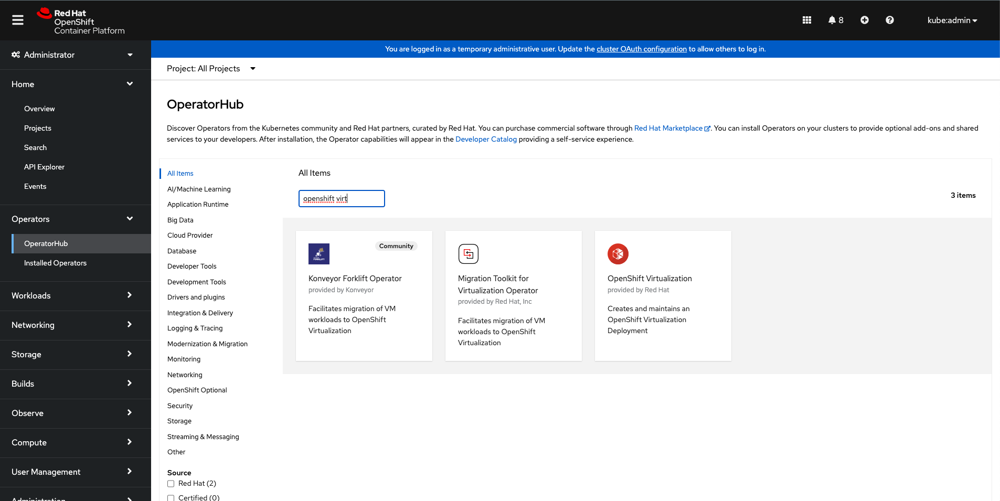
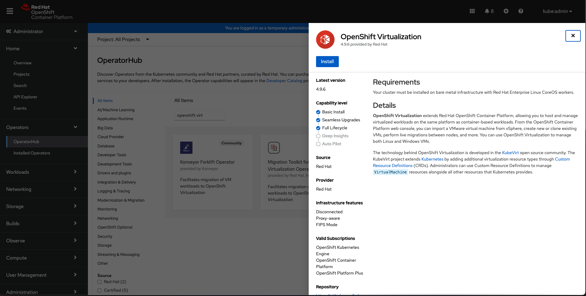
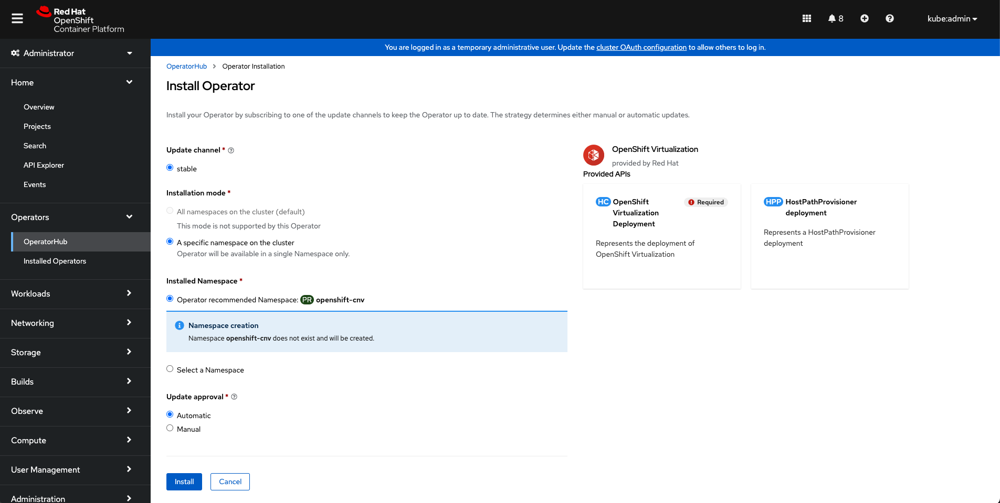
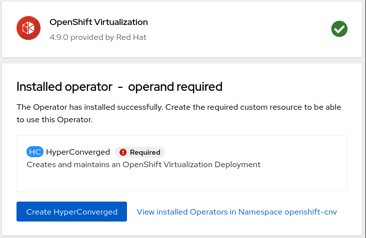

# OCP-CNV

## Login to the lab

The environment "OpenShift AIO with OCP Virtualization" is needed from RHPDS.
Login to lab host with the information from received email

```
ssh lab-user@145.40.121.163
```

SSH to bastion then

```
ssh root@192.168.123.100
```

Get kubeadmin password of the environment

```
echo $(cat /root/ocp-install/auth/kubeadmin-password)
```

Get the console URL

```
oc whoami --show-console
```

Validate the cluster is healty

```
oc get nodes
```

## Deploying OpenShift Virtualization

- Open the OpenShift console and go to Operator hub menu





- Next we need to deploy the HyperConverged resource, which, in addition to the OpenShift Virtualization operator, creates and maintains an OpenShift Virtualization Deployment for the cluster. Click on "Create HyperConverged", as a required operand, in the same screen to proceed.



- This will open a new screen. We can again accept all the defaults for this lab. Continue the installation by clicking on "Create" at the bottom.


- After a while, all these pods must be in RUNNING status

```
watch -n2 'oc get pods -n openshift-cnv'
```

- The operator installation just be in succeded

```
oc get csv -n openshift-cnv
```
