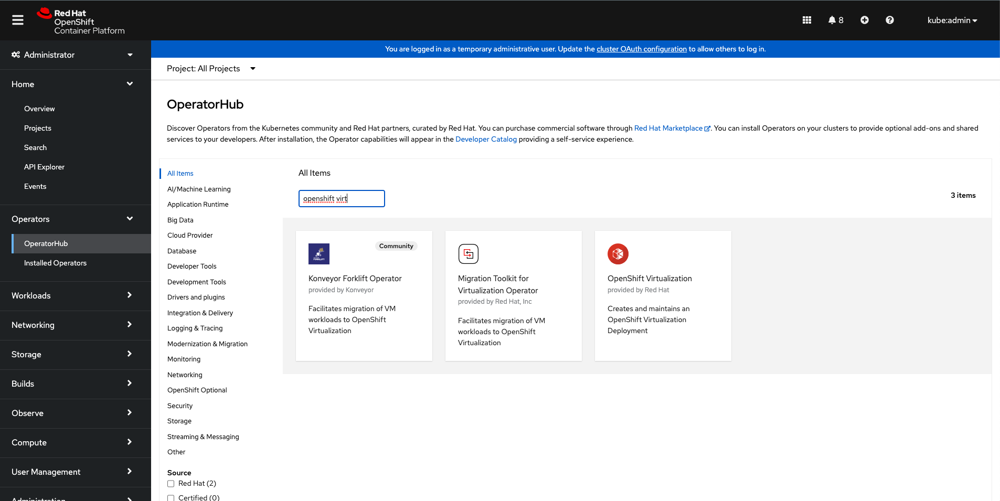
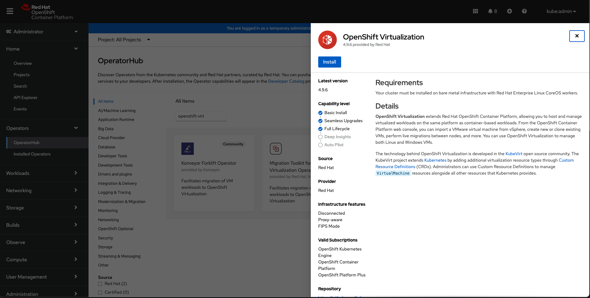
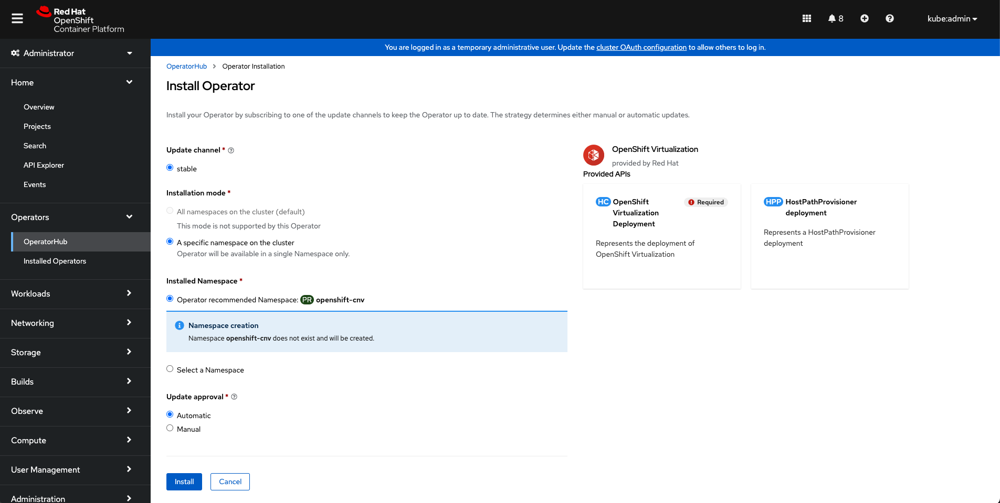
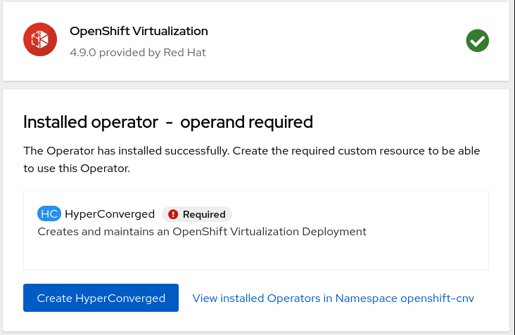
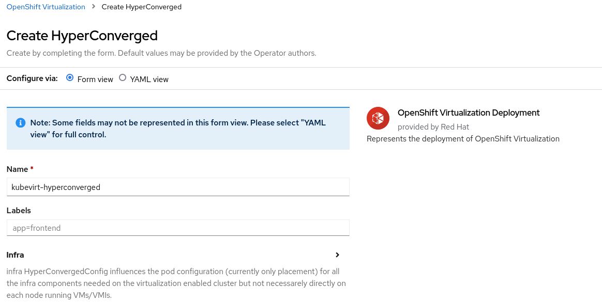
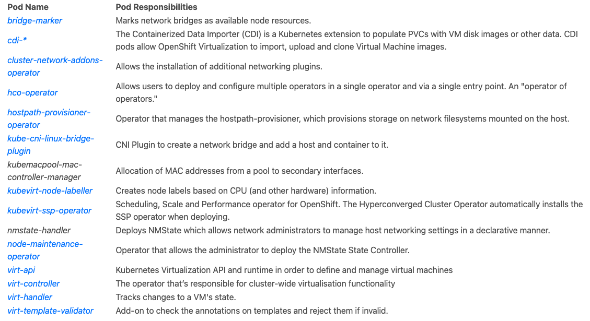

# OCP-CNV

## Deploying OpenShift Virtualization

- Open the OpenShift console and go to Operator hub menu

  
  
  

- Next we need to deploy the HyperConverged resource, which, in addition to the OpenShift Virtualization operator, creates and maintains an OpenShift Virtualization Deployment for the cluster. Click on "Create HyperConverged", as a required operand, in the same screen to proceed.

  

- This will open a new screen. We can again accept all the defaults for this lab. Continue the installation by clicking on "Create" at the bottom.

  

- After a while, all these pods must be in RUNNING status

  ```
  watch -n2 'oc get pods -n openshift-cnv'
  ```

- The operator installation just be in succeded

  ```
  oc get csv -n openshift-cnv
  ```

- Description of the pods:

  

- There's also a few custom resources that get defined too. For example the NodeNetworkState (nns) provides the current network configuration of our nodes - this is used to verify whether physical networking configurations have been successfully applied by the nmstate-handler pods. This is useful for ensuring that the NetworkManager state on each node is configured as required. We use this for defining interfaces/bridges on each of the machines for both physical machine connectivity and for providing network access for pods (and virtual machines) within OpenShift/Kubernetes. View the NodeNetworkState state with:

  ```
  oc get nns -A
  ```

  Example:

  ```
  [root@ocp4-bastion ~]# oc get nns -A
  NAME                           AGE
  ocp4-master1.aio.example.com   9m45s
  ocp4-master2.aio.example.com   9m47s
  ocp4-master3.aio.example.com   9m56s
  ocp4-worker1.aio.example.com   9m54s
  ocp4-worker2.aio.example.com   9m50s
  ocp4-worker3.aio.example.com   9m57s
  [root@ocp4-bastion ~]#
  ```

- You can then view the details of each managed node with:

  ```
  oc get nns/ocp4-worker1.aio.example.com -o yaml
  ```

## Storage

- Check Storage Classes of the lab

  ```
  oc get sc
  ```

- Then check which version of the OCS operator is installed by executing the following

  ```
  oc get csv -n openshift-storage
  ```

- Create the PVC with all this included:

  ```
  cat << EOF | oc apply -f -
  apiVersion: v1
  kind: PersistentVolumeClaim
  metadata:
    name: "rhel8-ocs"
    labels:
      app: containerized-data-importer
    annotations:
      cdi.kubevirt.io/storage.import.endpoint: "http://192.168.123.100:81/rhel8-kvm.img"
  spec:
    volumeMode: Block
    storageClassName: ocs-storagecluster-ceph-rbd
    accessModes:
    - ReadWriteMany
    resources:
      requests:
        storage: 40Gi
  EOF
  ```

- Once created, CDI triggers the importer pod automatically to take care of the conversion for you:

  ```
  oc get pods
  ```

- You should see the importer pod as below:

  ```
  NAME                   READY   STATUS              RESTARTS   AGE
  importer-rhel8-ocs     0/1     ContainerCreating   0          1s
  ```

- DO: Watch the logs and you can see the process, it may initially give an error about the pod waiting to start, you can retry after a few seconds:

  ```
  oc logs importer-rhel8-ocs -f
  ```

- You will see the log output as below:

  ```
  I1103 17:33:42.409423       1 importer.go:52] Starting importer
  I1103 17:33:42.442150       1 importer.go:135] begin import process
  I1103 17:33:42.447139       1 data-processor.go:329] Calculating available size
  I1103 17:33:42.448349       1 data-processor.go:337] Checking out block volume size.
  I1103 17:33:42.448380       1 data-processor.go:349] Request image size not empty.
  I1103 17:33:42.448395       1 data-processor.go:354] Target size 40Gi.
  I1103 17:33:42.448977       1 nbdkit.go:269] Waiting for nbdkit PID.
  I1103 17:33:42.949247       1 nbdkit.go:290] nbdkit ready.
  I1103 17:33:42.949288       1 data-processor.go:232] New phase: Convert
  I1103 17:33:42.949328       1 data-processor.go:238] Validating image
  I1103 17:33:42.969690       1 qemu.go:250] 0.00
  I1103 17:33:47.145392       1 qemu.go:250] 1.02
  I1103 17:33:53.728302       1 qemu.go:250] 2.03
  I1103 17:33:55.924329       1 qemu.go:250] 3.05
  I1103 17:33:58.014054       1 qemu.go:250] 4.06
  (...)
  I0317 11:46:56.253155       1 prometheus.go:69] 98.24
  I0317 11:46:57.253350       1 prometheus.go:69] 100.00
  I0317 11:47:00.195494       1 data-processor.go:205] New phase: Resize
  I0317 11:47:00.524989       1 data-processor.go:268] Expanding image size to: 40Gi
  I0317 11:47:00.878420       1 data-processor.go:205] New phase: Complete
  ```

- Display the PVC

  ```
  oc get pvc
  ```

- Display the PVs

  ```
  oc get pv
  ```

## Networking

- With OpenShift Virtualization (or more specifically, OpenShift in general - regardless of the workload type) we have a few different options for networking.
- We can just have our virtual machines be attached to the same pod networks that our containers would have access to, or we can configure more "real-world" virtualisation networking constructs like bridged networking, SR/IOV, and so on.
- It's also possible to have a combination of these, e.g. both pod networking and a bridged interface directly attached to a VM at the same time, using Multus, the default networking CNI in OpenShift 4.x.
- Multus allows multiple "sub-CNI" devices to be attached to a pod (regardless of whether a virtual machine is running there).
- In this lab we're going to utilise pod networking and a secondary network interface provided by a bridge on the underlying worker nodes (hypervisors).
- Each of the worker nodes has been configured with an additional network interface enp3s0
- we'll create a bridge device, called br1, so we can attach our virtual machines to it
- this network is actually the same L2 network as the one attached to enp2s0, so it's on the lab network ( 192.168.123.0/24) as well.

- The first step is to use the new Kubernetes NetworkManager state configuration to setup the underlying hosts to our liking.
- Recall that we can get the current state by requesting the NetworkNodeState (much of the following is snipped for brevity):

  ```
  oc get nns
  oc get nns/ocp4-worker1.aio.example.com -o yaml
  ```

- Apply a new NodeNetworkConfigurationPolicy for our worker nodes to setup a desired state for br1 via enp3s0, noting that in the spec we specify a nodeSelector to ensure that this only gets applied to our worker nodes; eventually allowing us to attach VM's to this bridge

  ```
  cat << EOF | oc apply -f -
  apiVersion: nmstate.io/v1alpha1
  kind: NodeNetworkConfigurationPolicy
  metadata:
    name: br1-enp3s0-policy-workers
  spec:
    nodeSelector:
      node-role.kubernetes.io/worker: ""
    desiredState:
      interfaces:
        - name: br1
          description: Linux bridge with enp3s0 as a port
          type: linux-bridge
          state: up
          ipv4:
            enabled: false
          bridge:
            options:
              stp:
                enabled: false
            port:
              - name: enp3s0
  EOF
  ```

- Then enquire as to whether it was successfully applied:

  ```
  oc get nnce
  ```

- Check the status (it may take a few checks before all show as "Available", i.e. applied the requested configuration, it will go from "Pending" --> "Progressing" --> "Available"):

  ```
  NAME                                                     STATUS
  ocp4-worker1.aio.example.com.br1-enp3s0-policy-workers   Available
  ocp4-worker2.aio.example.com.br1-enp3s0-policy-workers   Available
  ocp4-worker3.aio.example.com.br1-enp3s0-policy-workers   Available
  ```

- You can also request the status of the overall policy:

  ```
  oc get nncp
  ```

- Let's create the NetworkAttachmentDefinition, this associates the bridge we just defined with a logical name, known here as 'tuning-bridge-fixed':

  ```
  cat << EOF | oc apply -f -
  apiVersion: "k8s.cni.cncf.io/v1"
  kind: NetworkAttachmentDefinition
  metadata:
    name: tuning-bridge-fixed
    annotations:
      k8s.v1.cni.cncf.io/resourceName: bridge.network.kubevirt.io/br1
  spec:
    config: '{
      "cniVersion": "0.3.1",
      "name": "groot",
      "plugins": [
        {
          "type": "cnv-bridge",
          "bridge": "br1"
        },
        {
          "type": "tuning"
        }
      ]
    }'
  EOF
  ```

## For Cloning exercise

- Setup our Fedora 34 cloud image, let's first connect to our bastion host so we can process and serve the image from there. First ssh to bastion node (password is redhat):

  ```
  ssh root@192.168.123.100
  ```

- Change directory to /var/www/html where we'll serve the image from via Apache:

  ```
  cd /var/www/html
  ```

- Download the latest Fedora 34 cloud image to this directory:

  ```
  wget https://download-ib01.fedoraproject.org/pub/fedora/linux/releases/34/Cloud/x86_64/images/Fedora-Cloud-Base-34-1.2.x86_64.raw.xz
  ```

- Wait for the download to complete and extract/decompress the image:

  ```
  xz -d Fedora-Cloud-Base-34-1.2.x86_64.raw.xz
  ```

- NOTE: You will not see any output, but it may take a minute to complete.

- Check the cloud image file:

  ```
  ls -l | grep -i fedora
  ```

- It should show the following:

  ```
  -rw-r--r--. 1 root root  5368709120 Nov  5 08:40 Fedora-Cloud-Base-37-1.7.x86_64.raw
  ```

- Now we need to customise this image, we're going to do the following:

  - Permit root login over ssh
  - Reset the root password to "redhat"

- Install libguestfs-tools so we can modify the image:

  ```
  dnf install libguestfs-tools -y
  ```

- Enable libvirtd service as it's a dependency for libguestfs:

  ```
  systemctl enable --now libvirtd
  ```

- Now we're ready to customise the downloaded image. First we enable ssh logins for root and mark the system for an SELinux relabel:

  ```
  virt-customize -a /var/www/html/Fedora-Cloud-Base-34-1.2.x86_64.raw --run-command 'sed -i s/^#PermitRootLogin.*/PermitRootLogin\ yes/ /etc/ssh/sshd_config && touch /.autorelabel'
  ```

- Then remove cloud-init (as we don't need it during this lab) and set the root password to "redhat":

  ```
  virt-customize -a /var/www/html/Fedora-Cloud-Base-34-1.2.x86_64.raw --uninstall=cloud-init --root-password password:redhat --ssh-inject root:file:/root/.ssh/id_rsa.pub
  ```

- Create a Fedora VM

```
apiVersion: v1
kind: PersistentVolumeClaim
metadata:
  name: "fc34-original"
  labels:
    app: containerized-data-importer
  annotations:
    cdi.kubevirt.io/storage.import.endpoint: "http://192.168.123.100:81/Fedora-Cloud-Base-34-1.2.x86_64.raw"
spec:
  volumeMode: Block
  storageClassName: ocs-storagecluster-ceph-rbd
  accessModes:
  - ReadWriteMany
  resources:
    requests:
      storage: 40Gi
---
apiVersion: kubevirt.io/v1alpha3
kind: VirtualMachine
metadata:
  name: fc34-original
  labels:
    app: fc34-original
    os.template.kubevirt.io/fedora34: 'true'
    vm.kubevirt.io/template-namespace: openshift
    workload.template.kubevirt.io/server: 'true'
spec:
  running: true
  template:
    metadata:
      labels:
        vm.kubevirt.io/name: fc34-original
    spec:
      domain:
        cpu:
          cores: 1
          sockets: 1
          threads: 1
        devices:
          disks:
            - bootOrder: 1
              disk:
                bus: virtio
              name: disk0
          interfaces:
            - bridge: {}
              model: virtio
              name: nic0
          networkInterfaceMultiqueue: true
          rng: {}
        machine:
          type: pc-q35-rhel8.1.0
        resources:
          requests:
            memory: 1024M
      evictionStrategy: LiveMigrate
      hostname: fc34-original
      networks:
        - multus:
            networkName: tuning-bridge-fixed
          name: nic0
      terminationGracePeriodSeconds: 0
      volumes:
        - name: disk0
          persistentVolumeClaim:
            claimName: fc34-original
```

- Create the VM with the YAML file on CLI

  ```
  vi fedora.yaml
  oc create -f fedora.yaml
  ```

- Open Fedora VM console and install apache and figlet

  ```
  dnf install -y httpd figlet

  ```

- Modify /var/www/html/index.html and enable/start httpd

  ```
  systemctl enable httpd
  systemctl start httpd
  ```

- Test service

  ```
  curl localhost:80
  ```

- exit VM console
