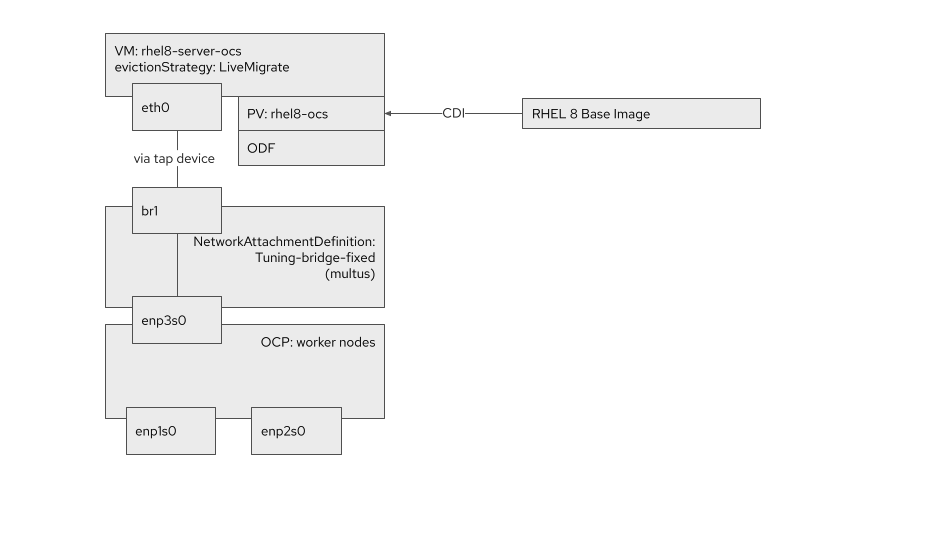
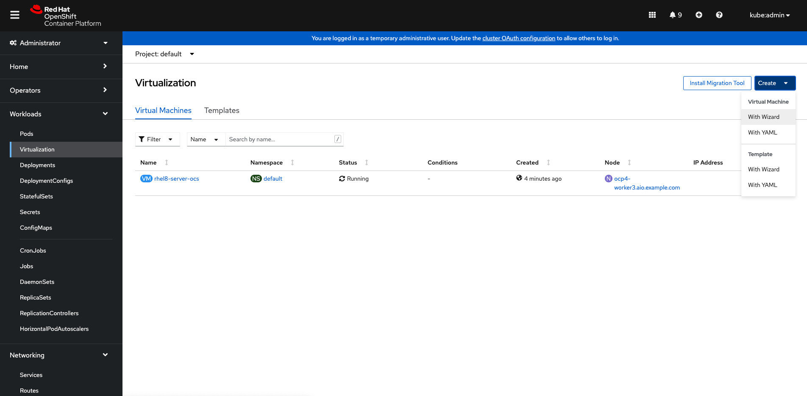
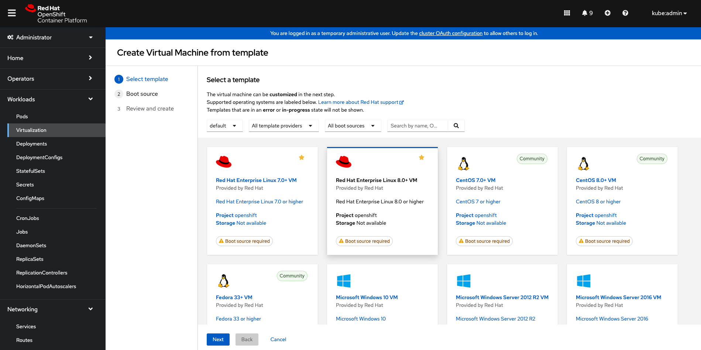
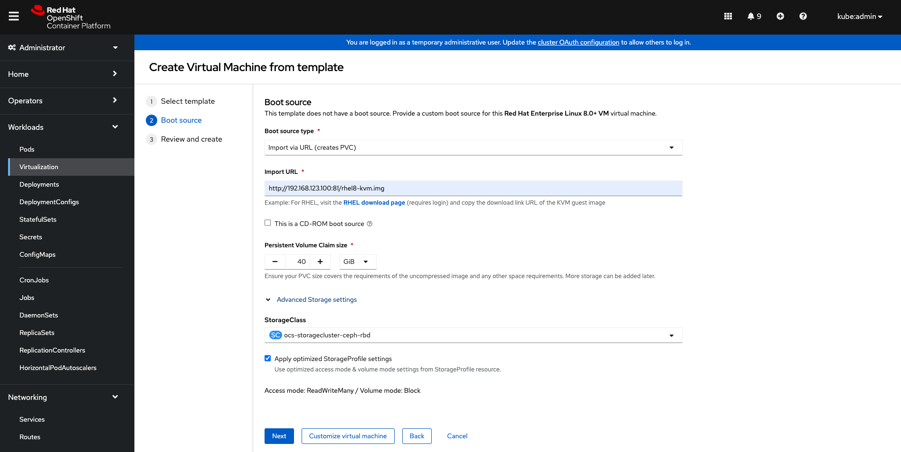
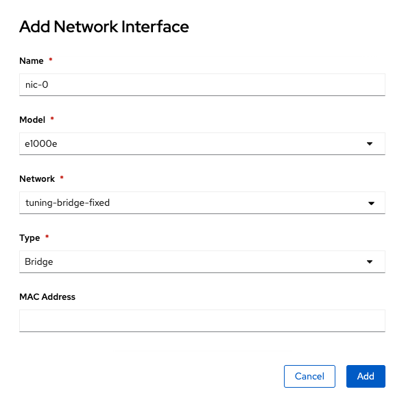
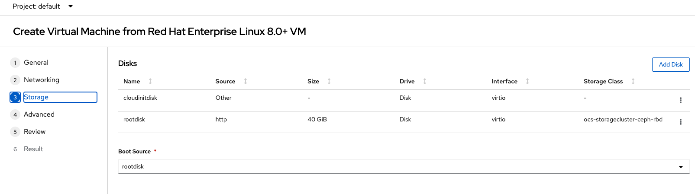
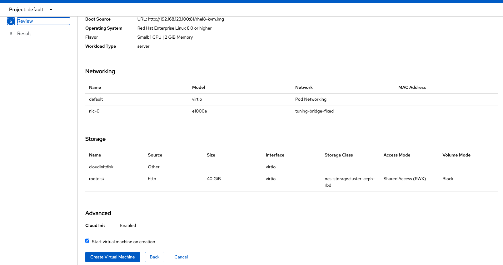

# Deploy Workloads

- The virtual machine we're going to create will have the following properties
- We are going to create a machine called rhel8-server-ocs.
- We'll utilise the Persistent Volume Claim (PVC) called rhel8-ocs that was created using the CDI utility with a CentOS 8 base image.
- We will utilise the NetworkAttachmentDefinition we created for the underlying host's third NIC (enp3s0 via br1). This is the tuning-bridge-fixed interface which refers to that bridge created previously.
- As we're using Multus as its default networking CNI we also ensure Multus attaches this NetworkAttachmentDefinition.
- Lastly we have set the evictionStrategy to LiveMigrate so that any request to move the instance will use this method (we will explore this in more depth in a later lab).



## Deploy a VM from a YAML file

- Let's apply this VM configuration via the CLI first:

  ```
  cat << EOF | oc apply -f -
  apiVersion: kubevirt.io/v1alpha3
  kind: VirtualMachine
  metadata:
    annotations:
      name.os.template.kubevirt.io/rhel8: Red Hat Enterprise Linux 8.0
    labels:
      app: rhel8-server-ocs
      kubevirt.io/os: rhel8
      os.template.kubevirt.io/rhel8: 'true'
      template.kubevirt.ui: openshift_rhel8-generic-small
      vm.kubevirt.io/template: openshift_rhel8-generic-small
      workload.template.kubevirt.io/generic: 'true'
    name: rhel8-server-ocs
  spec:
    running: true
    template:
      metadata:
        labels:
          vm.kubevirt.io/name: rhel8-server-ocs
      spec:
        domain:
          cpu:
            cores: 1
            sockets: 1
            threads: 1
          devices:
            disks:
            - disk:
                bus: sata
              name: rhel8-ocs
            interfaces:
            - bridge: {}
              model: e1000
              name: tuning-bridge-fixed
          firmware:
            uuid: 5d307ca9-b3ef-428c-8861-06e72d69f223
          machine:
            type: q35
          resources:
            requests:
              memory: 1024M
        evictionStrategy: LiveMigrate
        networks:
          - multus:
              networkName: tuning-bridge-fixed
            name: tuning-bridge-fixed
        terminationGracePeriodSeconds: 0
        volumes:
        - name: rhel8-ocs
          persistentVolumeClaim:
            claimName: rhel8-ocs
  EOF
  ```

- You should see a VirtualMachine object is created:

```
virtualmachine.kubevirt.io/rhel8-server-ocs created
```

- This starts to schedule the virtual machine across the available hypervisors, which we can see by viewing the VM and VMI objects:

```
oc get vm
```

- This command will list the VirtualMachine objects:

```
NAME               AGE   STATUS     READY
rhel8-server-ocs   4s    Starting   False
```

- Now execute following command to list the instance of that virtual machine object:

```
oc get vmi
```

- This command will list the VirtualMachineInstance objects:

```
NAME               AGE   PHASE     IP    NODENAME                       READY
rhel8-server-ocs   15s   Running         ocp4-worker3.aio.example.com   True
```

## Deploy a VMs from Wizard

- Click on Create > With Wizard under Administrator > Workloads > Virtualization

  

- Select RHEL 8 template and then next

  

- Select the following options and then click on "Customize Virtual Machine":

  - Boot Source type: Import via URL (creates PVC)
  - Import URL: http://192.168.123.100:81/rhel8-kvm.img
  - Persistent Volume Claim Size: 40 GB
  - Advance Settings:
    - Storage Class: ocs-storagecluster-ceph-rbd

  

- On the "Customize virtual machine" screen
  - 1 General:
    - Name: RHEL8-demo-test
  - 2 Networking:
    - Click on "Add another network interface"
    - Name: nic-0
    - Model: e1000e
    - Network: tuning-bridge-fixed
    - Type: Bridge
      
  - 3 Storage
    - Edit root disk to use "ocs-storagecluster-ceph-rbd"
      
  - 5 Review
    - Click "Create Virtual Machine"
      
