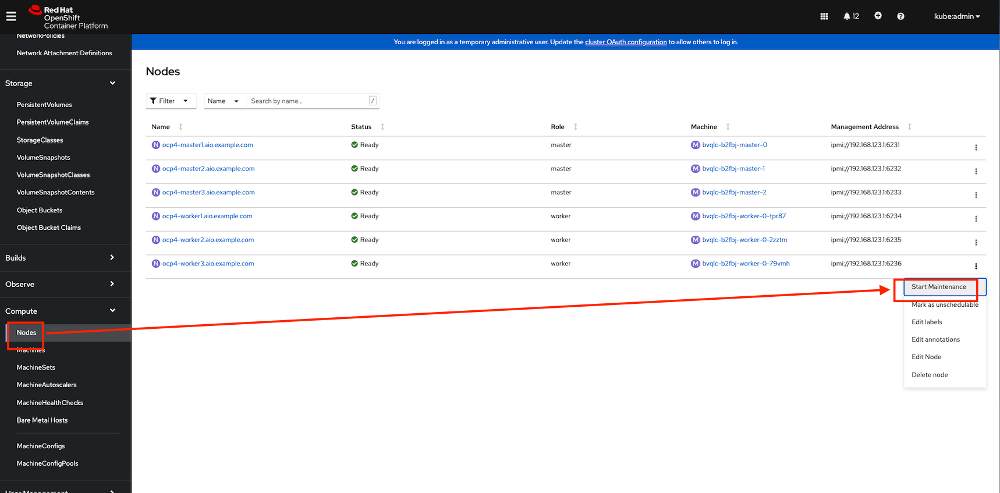

# Live Migration

- Live Migration is the process of moving an instance from one node in a cluster to another without interruption.
- This process can be manual or automatic.
- In OpenShift this is controlled by an evictionStrategy strategy.
- If this is set to LiveMigrate and the underlying node are placed into maintenance mode, VMs can be automatically moved between nodes with minimal interruption.

- From the OpenShift console:

  - select the virtual machine
  - Actions > Migarte Virtual Machine
  - Confirm
  - Pay attention on the worker node.

    

- Additional open a terminal and review the pods (virt-launcher)

  ```
  watch oc get pods -o wide
  ```

## Node Maintenance

- Building on-top of live migration, many organisations will need to perform node-maintenance, e.g. for software/hardware updates, or for decommissioning. During the lifecycle of a pod, it's almost a given that this will happen without compromising the workloads, but virtual machines can be somewhat more challenging given their nature. To address this OpenShift Virtualization has a node-maintenance feature which manages the process safely by marking nodes unschedulable and migrating workloads automatically.

- Let's take a look at the current running virtual machines and the nodes we have available:

  ```
  oc get nodes
  ```

- Start a maintenance from console

  
