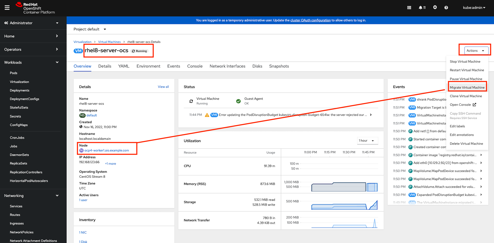

# Live Migration

- Live Migration is the process of moving an instance from one node in a cluster to another without interruption.
- This process can be manual or automatic.
- In OpenShift this is controlled by an evictionStrategy strategy.
- If this is set to LiveMigrate and the underlying node are placed into maintenance mode, VMs can be automatically moved between nodes with minimal interruption.

- From the OpenShift console:

  - select the virtual machine
  - Actions > Migarte Virtual Machine
  - Confirm
  - Pay attention on the worker node.

    

- Additional open a terminal and review the pods (virt-launcher)

  ```
  watch oc get pods -o wide
  ```
