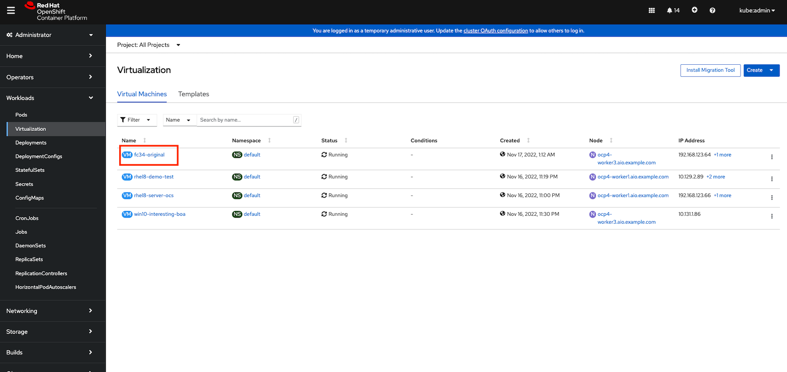
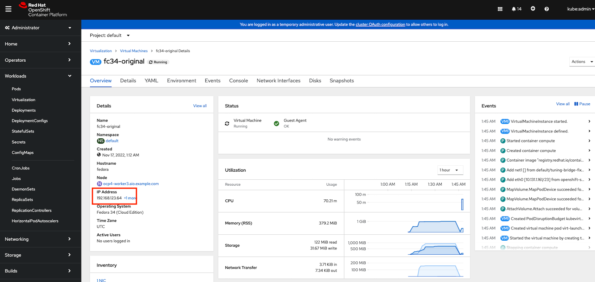
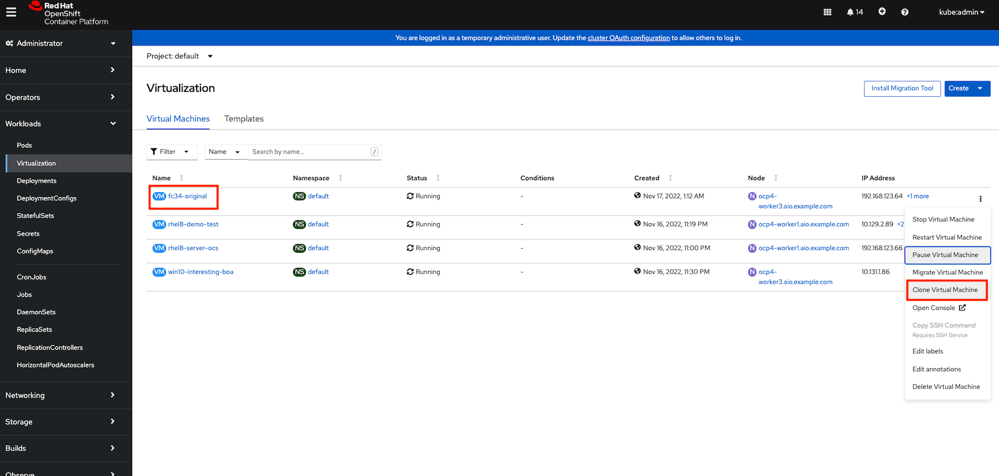
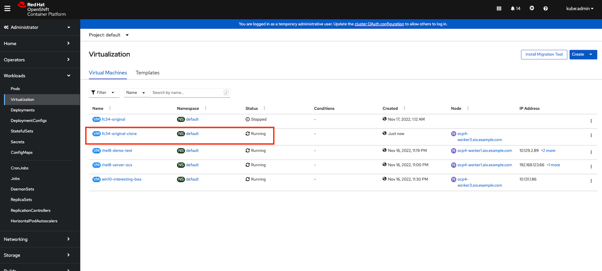

# Clone a Virtual Machine

In this lab we're going to clone a workload and see that it's identical to the source of the clone. To do this we'll complete the following steps:

- Using the console, get Fedore-original IP

  

- Note the IP address

  

- On bastion's CLI, run:

  ```
  curl IP:80
  ```

- Now, clone the VM

  

- After cloned VM is up, try again curl command with clone VM IP !!

  
